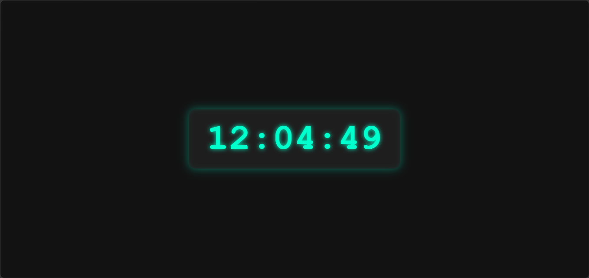

# ⏰ Jam Digital Aesthetic

Sebuah proyek jam digital sederhana yang dibuat menggunakan HTML, CSS, dan JavaScript murni. Tampilan dirancang dengan tema gelap modern serta efek neon yang memberikan kesan aesthetic dan futuristik.

## 📸 Preview



## ✨ Fitur

* Menampilkan waktu secara real-time
* Desain minimalis dan modern
* Efek neon glow yang menarik
* Tema gelap (dark mode)
* Tampilan responsif
* Dibuat tanpa framework atau library tambahan

## 🛠️ Teknologi yang Digunakan

* HTML5
* CSS3
* JavaScript

## 🚀 Cara Menjalankan

1. Download atau clone repository ini.
2. Buka file `index.html` menggunakan browser.
3. Jam digital akan langsung berjalan dan memperbarui waktu setiap detik.

## 📂 Struktur Proyek

```text
├── index.html
├── preview.png
└── README.md
```

## 📄 Lisensi

Proyek ini bebas digunakan untuk keperluan belajar, pengembangan, dan referensi pribadi.
